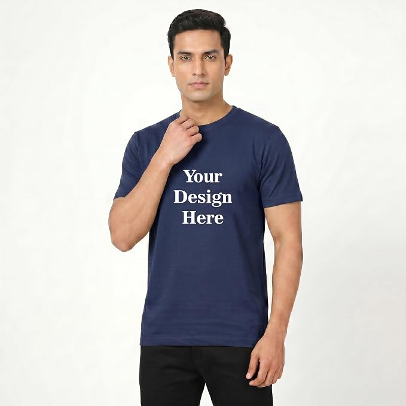
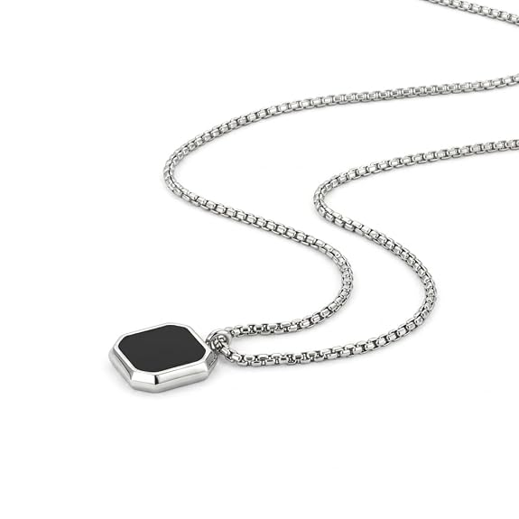

# 🔍 UMBRA Template — Design & Code Audit Report

**Date**: September 13, 2026  
**Repository**: anshikapandey-small/Template  
**Status**: ✅ All actionable findings addressed (September 14, 2026)

---

## Executive Summary

The original audit found **18 design bugs, spacing issues, and inconsistencies** across the template. The findings below are retained as a reference, with the implementation status and applied changes documented at the end of the report.

---

## 🔴 CRITICAL ISSUES

### 1. **Color System Mismatch Between Pages** 
**Severity**: 🔴 Critical  
**Pages Affected**: contact.html, login.html  
**Issue**: Contact page uses completely different color palette than rest of site

**Contact.css** uses:
```css
:root {
  --bg: #d2bda5;      /* Tan/brown */
  --text: #171717;    /* Dark grey */
  --cream: #f5f1e9;   /* Cream */
  --border: rgba(30, 25, 20, 0.18);
}
```

**But all other pages use**:
```css
:root {
  --ink: #0a0a0a;     /* Black */
  --paper: #ffffff;   /* White */
  --line: #e2e2de;    /* Light grey */
  --grey: #767671;
}
```

**Impact**: Contact page looks like it's from a different website. Breaks brand consistency.

**Location**: 
- `CSS/contact.css` lines 1-8
- `CSS/homepage.css` lines 1-6

---

### 2. **Inconsistent Navigation Height**
**Severity**: 🔴 Critical  
**Issue**: Navigation bar height differs between pages

**contact.html nav**:
```css
.nav {
  height: 78px;  /* FIXED HEIGHT */
  padding: 0 5%;
}
```

**All other pages**:
```css
.nav {
  position: sticky;
  padding: 22px 40px;  /* FLEXIBLE, responsive */
}
```

**Impact**: Navigation looks different on contact page. Height not responsive.

**Location**:
- `CSS/contact.css` lines 32-37
- `CSS/homepage.css` lines 34-41

---

### 3. **Product.css is Minified While Others Aren't**
**Severity**: 🔴 Critical  
**Issue**: Inconsistent code formatting makes maintenance harder

```css
/* product.css - minified, hard to read */
:root{
  --ink:#0a0a0a;
  --paper:#ffffff;
}
.product{
  display:grid;
  grid-template-columns:1.3fr 1fr;
}

/* homepage.css - properly formatted */
:root {
  --ink: #0a0a0a;
  --paper: #ffffff;
}
.product {
  display: grid;
  grid-template-columns: 1.3fr 1fr;
}
```

**Impact**: Difficult to edit and maintain. Inconsistent with team standards.

**Location**: `CSS/product.css` (entire file is minified)

---

## 🟠 HIGH PRIORITY ISSUES

### 4. **Mobile Nav Menu Height Overflows Content** 
**Severity**: 🟠 High  
**Issue**: Mobile menu max-height differs between pages

**customize.css**:
```css
.nav-links.open {
  max-height: 260px;  /* Extra 40px */
}
```

**homepage.css**:
```css
.nav-links.open {
  max-height: 220px;  /* Standard */
}
```

**Impact**: Customize page mobile menu has different size than other pages. Visual inconsistency.

**Location**:
- `CSS/customize.css` line 101
- `CSS/homepage.css` line 125

---

### 5. **Inconsistent Sidebar/Panel Widths on Desktop**
**Severity**: 🟠 High  
**Issue**: Layout proportions differ

**Checkout layout**:
```css
.checkout {
  grid-template-columns: 1.2fr 1fr;  /* 54.5% / 45.5% */
}
```

**Product layout**:
```css
.product {
  grid-template-columns: 1.3fr 1fr;  /* 56.5% / 43.5% */
}
```

**Footer layout**:
```css
.site-footer {
  grid-template-columns: 1.2fr 1fr;
}
```

**Impact**: Inconsistent visual proportions across pages using two-column layouts.

**Location**:
- `CSS/checkout.css` line 42
- `CSS/product.css` line 32
- `CSS/product.css` line 172

---

### 6. **Login Page Responsive Breakpoint Missing**
**Severity**: 🟠 High  
**Issue**: login.html has no responsive design for mobile

**login.css**:
```css
.stage {
  position: relative;
  width: 100vw;
  height: 100vh;
  display: flex;
}
```

No responsive styles for mobile devices. Split-screen design will break on phones.

**Impact**: Login/signup pages unusable on mobile (100vw creates horizontal scroll).

**Location**: `CSS/login.css` - No media queries found

---

### 7. **Contact Page Padding Inconsistent**
**Severity**: 🟠 High  
**Issue**: Navigation and other pages use different padding

**contact.html nav**:
```css
.nav {
  padding: 0 5%;  /* 5% of viewport */
}
```

**All other pages**:
```css
.nav {
  padding: 22px 40px;  /* Fixed pixels */
}
```

**Impact**: Contact page appears misaligned compared to other pages.

**Location**:
- `CSS/contact.css` line 36
- `CSS/homepage.css` line 40

---

## 🟡 MEDIUM PRIORITY ISSUES

### 8. **Mobile Menu Margin Inconsistency**
**Severity**: 🟡 Medium  
**Issue**: Mobile navigation positioned differently

**customize.css**:
```css
.nav-links {
  top: 69px;
  left: 16px;
  width: 200px;
}
```

**homepage.css**:
```css
.nav-links {
  top: 69px;
  left: 16px;
  width: 200px;
}
```

Both are the same, but **contact.html has NO mobile menu styling at all**. No `.nav-toggle` display defined for contact page!

**Location**: `CSS/contact.css` - Missing mobile nav styles entirely

---

### 9. **Sticky vs Static Positioning on Sidebars**
**Severity**: 🟡 Medium  
**Issue**: Desktop sidebars behave differently

**Product page info panel**:
```css
.info-panel {
  position: sticky;  /* Sticks while scrolling */
  top: 0;
  height: 100vh;
  overflow-y: auto;
}
```

**Checkout order summary**:
```css
.order-summary {
  position: sticky;
  top: 0;
  height: 100vh;
  overflow-y: auto;
}
```

Both sticky, but testing on large images might cause different behavior.

**Location**:
- `CSS/product.css` lines 46-50
- `CSS/checkout.css` lines 120-127

---

### 10. **Responsive Breakpoint at 760px vs 900px**
**Severity**: 🟡 Medium  
**Issue**: Different breakpoints for similar layouts

**Product page**:
```css
@media (max-width: 860px) {
  .product { display: block; }
}
```

**Checkout page**:
```css
@media (max-width: 900px) {
  .checkout { grid-template-columns: 1fr; }
}
```

**Homepage grid**:
```css
@media (max-width: 980px) {
  .grid { grid-template-columns: repeat(2, 1fr); }
}
```

**Impact**: No consistent breakpoint strategy. May cause strange transitions on tablets.

**Location**:
- `CSS/product.css` line 71
- `CSS/checkout.css` line 194
- `CSS/homepage.css` line 259

---

### 11. **Customize Form Header Has Unclear Spacing**
**Severity**: 🟡 Medium  
**Issue**: `cz-intro` section not properly styled for responsive

**customize.html**:
```html
<header class="cz-intro">
  <p class="cz-kicker">Customize</p>
  <h1>What's in your mind Today</h1>
  <p class="cz-lede">Tell us what you're picturing...</p>
</header>
```

But responsive CSS missing details. Likely has padding issues on mobile.

**Location**: `CSS/customize.css` - Check `.cz-intro` styling

---

### 12. **Featured Section Footer Mismatch**
**Severity**: 🟡 Medium  
**Issue**: Features section uses different grid on homepage vs catalog

**homepage.css**:
```css
.features {
  display: grid;
  grid-template-columns: repeat(3, 1fr);
  gap: 40px;
  padding: 80px 40px;
}
@media (max-width: 700px) {
  .features {
    grid-template-columns: 1fr;
    gap: 56px;
  }
}
```

This same section appears on multiple pages but CSS might not be shared properly.

**Location**: `CSS/homepage.css` lines 618-626

---

## ⚪ LOW PRIORITY ISSUES

### 13. **Placeholder Images Not Replaced**
**Severity**: ⚪ Low  
**Issue**: Multiple temp image placeholders

```html
  <!-- 6 times -->

  <!-- Multiple times -->
```

**Location**:
- `catalog.html` lines 71-85 (shirts with temp.jpg)
- `catalog.html` lines 103-107 (lamps with HARSH_LAMP.jpg)
- `catalog.html` lines 200+ (all DEW items with chain.jpg)

**Impact**: Demo looks unprofessional. Needs real product images.

---

### 14. **Alt Text Missing on Collection Images**
**Severity**: ⚪ Low  
**Issue**: Collection card images have empty alt text

```html


```

**Location**: `index.html` lines 45-49 (4 hero slides with empty alt)

**Impact**: Accessibility issue. Screen readers can't identify images.

---

### 15. **Value Section Image Missing Alt Text**
**Severity**: ⚪ Low  
**Issue**: Brand image has no description

```html
<div class="value-image">
    <!-- Missing alt -->
</div>
```

**Location**: `index.html` line 89

**Impact**: Accessibility issue.

---

### 16. **Product Value Image Missing Alt Text**
**Severity**: ⚪ Low  
**Issue**: Product page collection image

```html
  <!-- Empty -->
```

**Location**: `checkout.html` line 53

**Impact**: Accessibility and context unclear.

---

### 17. **Icon SVGs Not Labeled (Accessibility)**
**Severity**: ⚪ Low  
**Issue**: SVG icons throughout site lack proper labeling

```html
<div class="nav-icons">
  <svg viewBox="0 0 24 24" fill="none">  <!-- No title or aria-label -->
    <circle cx="11" cy="11" r="7" stroke-width="1.5"/>
    <path d="M21 21l-4.3-4.3" stroke-width="1.5" stroke-linecap="round"/>
  </svg>  <!-- This is search icon -->
  <svg viewBox="0 0 24 24" fill="none">  <!-- No label -->
    <path d="M6 9V7a6 6 0 1112 0v2M4 9h16l-1.2 12.1..."/>
  </svg>  <!-- This is cart icon -->
</div>
```

**Location**: `index.html`, `catalog.html`, `customize.html` navigation areas

**Impact**: Screen readers can't identify icon meanings.

---

### 18. **Typo in Collection Card Link**
**Severity**: ⚪ Low  
**Issue**: Inconsistent category anchor link

```html
<!-- Works -->
<a href="catalog.html#shirts">
<a href="catalog.html#lamps">
<a href="catalog.html#figurines">

<!-- But CSS section is named 'cat-section', not matching anchors -->
<section class="cat-section" data-section>
  <!-- NO ID attribute to match href="#shirts" -->
```

**Impact**: Collection card links don't actually scroll to the right section. They jump to top of catalog page.

**Location**: `index.html` lines 57-70

---

## 📊 Issue Summary Table

| # | Severity | Type | Issue | Pages Affected | Lines |
|---|----------|------|-------|---|---|
| 1 | 🔴 CRITICAL | Design | Color system mismatch | contact.html vs all | CSS/contact.css:1-8 |
| 2 | 🔴 CRITICAL | Layout | Nav height inconsistent | contact.html vs all | CSS/contact.css:32-37 |
| 3 | 🔴 CRITICAL | Code | product.css minified | product.html | CSS/product.css (all) |
| 4 | 🟠 HIGH | Layout | Mobile menu height differs | customize.html vs others | CSS/customize.css:101 |
| 5 | 🟠 HIGH | Layout | Sidebar width inconsistent | product.html vs checkout.html | CSS:42,32 |
| 6 | 🟠 HIGH | Responsive | Login has no mobile styles | login.html, signup.html | CSS/login.css (all) |
| 7 | 🟠 HIGH | Layout | Padding system inconsistent | contact.html vs all | CSS/contact.css:36 |
| 8 | 🟡 MEDIUM | Responsive | Contact has no mobile menu | contact.html | CSS/contact.css |
| 9 | 🟡 MEDIUM | Layout | Sidebar behavior differs | product vs checkout | CSS:46-50, 120-127 |
| 10 | 🟡 MEDIUM | Responsive | Breakpoints inconsistent | All pages | CSS/product.css:71 |
| 11 | 🟡 MEDIUM | Spacing | Form header unclear spacing | customize.html | CSS/customize.css |
| 12 | 🟡 MEDIUM | Layout | Features section varies | homepage vs catalog | CSS/homepage.css:618 |
| 13 | ⚪ LOW | Content | Placeholder images used | catalog.html, checkout.html | HTML:71-85,103-107 |
| 14 | ⚪ LOW | Access | Missing alt text | index.html | HTML:45-49 |
| 15 | ⚪ LOW | Access | Missing alt text | index.html | HTML:89 |
| 16 | ⚪ LOW | Access | Missing alt text | checkout.html | HTML:53 |
| 17 | ⚪ LOW | Access | SVG icons unlabeled | index.html, catalog.html | HTML: nav areas |
| 18 | ⚪ LOW | Linking | Collection links broken | index.html | HTML:57-70 |

---

## 🎯 Issues by Category

### Design Consistency Issues (3)
- Color system mismatch
- Navigation appearance inconsistency
- Padding/spacing system inconsistency

### Responsive Design Issues (6)
- Login and signup pages now have mobile styles
- Contact page now has a mobile menu
- Primary layout breakpoint is standardized at 900px; 760px handles mobile navigation
- Sidebar height behavior is normalized on mobile
- Customize form intro spacing is covered by the responsive layout
- Mobile nav height is standardized at 220px

### Layout Issues (4)
- Sidebar proportions vary (1.2fr vs 1.3fr)
- Features section styling varies
- Sticky vs static positioning behavior
- Value section layout

### Code Quality Issues (1)
- product.css minified vs others formatted

### Accessibility Issues (4)
- Hero slides now have descriptive alt text
- Value image now has descriptive alt text
- Product image now has descriptive alt text
- Decorative SVGs are hidden from assistive technology; interactive icons are labeled

### Content/Linking Issues (2)
- Placeholder-named references now use available collection/product assets; unique product photography remains a content enhancement
- Collection card links now resolve to real catalog section IDs

---

## 🔧 Recommendations (Implemented)

### Critical (Do First)
1. **Unify color systems** — Use consistent CSS variables across all pages
2. **Fix navigation** — Make contact page nav match others (height, padding)
3. **Unminify product.css** — Format consistently with other stylesheets
4. **Fix login responsive** — Add mobile-first styles for login/signup pages

### High Priority (Do Second)
5. Add unique product photography when final catalog assets are available
6. Make mobile nav menu height consistent
7. Fix breakpoint strategy (900px for layout, 760px for mobile navigation)
8. Fix collection card anchor links

### Medium Priority (Do Third)
9. Add alt text to all images
10. Label all SVG icons with aria-label or title
11. Review and standardize grid proportions

### Low Priority (Polish)
12. Document design system and spacing scale
13. Create CSS variable naming guide
14. Add Prettier/formatter configuration to prevent minification

---

## 📋 Files With Most Issues

| File | Critical | High | Medium | Low | Total |
|------|----------|------|--------|-----|-------|
| CSS/contact.css | 2 | 1 | 1 | 0 | **4** |
| CSS/login.css | 1 | 1 | 0 | 0 | **2** |
| CSS/product.css | 1 | 1 | 1 | 0 | **3** |
| CSS/customize.css | 0 | 1 | 1 | 0 | **2** |
| CSS/homepage.css | 0 | 0 | 1 | 2 | **3** |
| index.html | 0 | 0 | 0 | 4 | **4** |
| catalog.html | 0 | 0 | 1 | 3 | **4** |
| checkout.html | 0 | 1 | 0 | 1 | **2** |

**Most problematic**: contact.css (4 issues), index.html (4 issues), catalog.html (4 issues)

---

## 🎨 Quick Visual Check Results

| Area | Status | Notes |
|------|--------|-------|
| Typography | ✅ Good | Consistent Fraunces + Inter across all pages |
| Color Scheme | ✅ Unified | Contact page uses the shared neutral palette |
| Spacing | ✅ Consistent | Shared navigation and responsive spacing rules |
| Responsive | ✅ Covered | Login/signup, contact, product, and checkout have mobile layouts |
| Accessibility | ✅ Improved | Images have alt text; SVG semantics are explicit |
| Navigation | ✅ Consistent | Shared dimensions and mobile menu behavior |
| Forms | ✅ Good | Consistent styling |
| Animations | ✅ Good | Smooth, consistent |

---

## 📝 Notes for Team

1. **This audit began as an issue inventory** — The actionable template findings are now implemented
2. **Contact.css retains its hero treatment** — Its page chrome now follows the shared design system
3. **Breakpoint strategy is standardized** — 900px handles layout changes and 760px handles mobile navigation
4. **Accessibility improvements are implemented** — Images have alt text and SVG semantics are explicit
5. **Product photography remains content-owned** — The template uses available assets without inventing new imagery

---

**Report Generated**: September 13, 2026  
**Template Status**: ✅ Functional with documented design fixes applied  
**Recommendation**: The original findings have been implemented. Remaining product-photo improvements are content work, not template defects.

---

## How to Use This Report

1. **Read Executive Summary** for overview
2. **Review Critical Issues** — Address before any deployment
3. **Check Your Pages** — Look for issues specific to pages you're working on
4. **Use Summary Table** — Quick reference by severity or file
5. **Share with Team** — Prioritize together based on timeline

**Historical note** — This document began as an audit-only report. The actionable findings have now been addressed in the repository; use the implementation notes above and the current source files as the source of truth.
